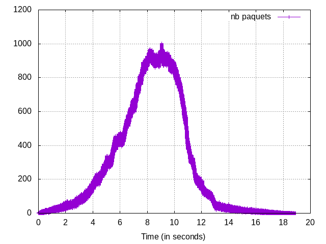
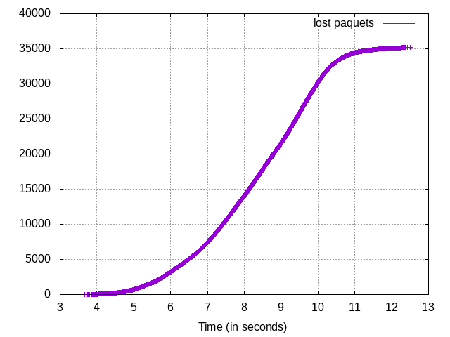

# Le programme

Pour ce TP il nous a été demandé de créer un programme pour analyser des traces.

## Compilation

Pour compiler le programme depuis les sources fournies, un simple `make` suffit.

Pour compiler le programme dans le but de voir comment il traite les fichiers,
il faut faire `make clean` si une version normale a déjà été compilée, puis
faire dans tous les cas un `make debug`.

## Exécution

Faire un `make run` permet de lancer le programme et d'afficher les données
globales.

Pour lancer le programme manuellement, et du coup pouvoir passer des arguments
particulier, il est possible de le lancer de la manière suivante :
`./main -t trace_file -m matrix_file -p packet_id -f flow_id`

avec :

  - l'option `-t` qui permet de spécifier un fichier de traces
    (par défaut vaut `trace2650.txt`)

  - l'option `-m` qui permet de spécifier un fichier contenant une matrice
    d'adjacences (par défaut `res26.txt`)

  - l'option `-p` permet de spécifier un id de paquet à tracer

  - l'option `-f` permet de spécifier un id de flux à tracer

## Génération des donnés pour `gnuplot`

Lors de son exécution, le programme va générer deux fichiers textes, qui sont
des fichiers contenants les données utiles pour `gnuplot`.

Ces deux fichiers sont :

  - `graph_nb_paquets.txt` : nombre de paquets actifs dans la simulation au
    cours du temps

  - `graph_lost_paquets.txt` : nombre de paquets perdus (cumulé) au fil du temps

Un script shell, `gen_graph.sh` est à appelé sans argument, dans le but de
générer les graphes visibles vers la fin de ce rapport, à partir de ces fichiers
texte. Il va générer des fichiers de même nom que les fichiers textes, mais avec
l'extension `.png`.

## Optimisations

Concernant l'implémentation : au départ le stockage des flux était fait
sous forme de liste chaînée, mais le fait que je vérifiais systématiquement
si un élément était déjà présent ou non me faisait parcourir l'ensemble de la
liste lors de chaque insertion, ce qui était vraiment très coûteux. J'ai donc
mis en place un mécanisme similaire aux *vector* que l'on peut retrouver en
C++, où dès que le tableau est plein, il va doubler sa taille. Comme ça j'ai pu
me retrouver comme avec un tableau statique, et l'accès est direct avec le *fid*
en tant qu'index; en faisant cela, le temps d'éxécution de mon programme a été
divisé par deux. J'ai également réimplémenté une lecture de fichier bufférisé
dans le but de limiter les accès disque.

# Résultats obtenus sur la trace fournie

Voici les différents résultats obtenus avec l'outil que j'ai réalisé pour
répondre au sujet du TP.

## Données globales

En lançant le programme sur les traces fournies, on obtient les résultats
suivants :

```
Number of nodes: 26
Number of flows: 3019
Number of events: 3502252
Number of packets emited (code 0): 750979
Number of packets arrivals (code 1): 1000147
Number of packets processed (code 2): 1000147
Number of packets received (code 3): 715815
Number of destroyed packets (code 4): 35164
Number of packets lost (code 0 - 3): 35164
Loss rate: 4.682421%
```

Il y a donc 26 noeuds au total, 3019 flux, 750 979 paquets émis (code 0),
1 000 147 paquets arrivés dans un autre noeud (code 1), 1 000 147 paquets
traités (code 2), 715 815 paquets arrivés à destination et 35 164 paquets
détruits. On peut constater que l'ensemble des pertes, qui correspond à
la différence entre les paquets émis et arrivés à destination, correspond au
nombre de paquets détruits. On peut donc en déduire que l'ensemble des pertes
correspondent bien à des destruction de paquets. Le taux de perte est de 4.68%.


## Traçage

### Parcours complet d'un paquet

Il est posssible d'analyser un paquet particulier grâce à son *pid*, qui aura
été passé en paramètre lors du lancement du programme.


Si le *pid* passé n'est pas trouvé dans la trace, on obtient un résultat :

```
Displaying traced paquet (#123456789) as requested: /!\ Paquet not found.
```

Si l'on trace le paquet de *pid* $3018$, on obtient :

```
Displaying traced paquet (#3018) as requested:

========= PID = 3018 =========
 - fid: 0
 - source: N23
 - destination: N16
 - life start: t=0.000000
 - end of life: t=0.001894
 - lifetime: 0.001894 sec
 - size: 0.002525 Mb
 - events:
    - [t=0.000000] CREATION (code=0) on node N23
    - [t=0.000000] LEAVE_QUEUE (code=2), going to N19. No waittime.
    - [t=0.000631] NODE_ARRIVAL (code=1) on node N19. Duration 0.000631 sec.
    - [t=0.000631] LEAVE_QUEUE (code=2), going to N1. No waittime.
    - [t=0.001263] NODE_ARRIVAL (code=1) on node N1. Duration 0.000631 sec.
    - [t=0.001263] LEAVE_QUEUE (code=2), going to N16. No waittime.
    - [t=0.001894] NODE_ARRIVAL (code=1) on node N16. Duration 0.000631 sec.
    - [t=0.001894] REACHED_DESTINATION (code=3) which is N16
```

On constate qu'il s'agit d'un paquet appartenant au flux $0$, qui a le noeud
N23 comme source et N16 comme destination, qu'il a une taille de 0.002525 Mb et
qu'il a eu une durée de vie de 0.001894 secondes.

Concernant le traitements des évènements qui lui sont associés, on voit qu'il
a bien été créé dans le noeud N23, qu'il a quitté la file directement pour se
diriger vers N19. Pour arriver à N19, il met 0.000631 secondes. Il arrive
ensuite à N1, puis à N16, sa destination, sans avoir à attendre dans les files.


Pour le paquet $2018$, on obtient :

```
Displaying traced paquet (#2018) as requested:

========= PID = 2018 =========
 - fid: 1000
 - source: N4
 - destination: N2
 - life start: t=3.320010
 - end of life: t=3.321472
 - lifetime: 0.001462 sec
 - size: 0.005881 Mb
 - events:
    - [t=3.320010] CREATION (code=0) on node N4
    - [t=3.320508] LEAVE_QUEUE (code=2), going to N6.
                   Waited 0.000498 sec in the queue.
    - [t=3.320990] NODE_ARRIVAL (code=1) on node N6. Duration 0.000482 sec.
    - [t=3.320990] LEAVE_QUEUE (code=2), going to N2. No waittime.
    - [t=3.321472] NODE_ARRIVAL (code=1) on node N2. Duration 0.000482 sec.
    - [t=3.321472] REACHED_DESTINATION (code=3) which is N2
```

On voit qu'il appartient au flux 1000, de source N4 et de destination N2.
L'ensemble des informations visibles sont très similaires à l'exemple précédent,
mis à part qu'ici, le paquet a dû attendre dans la file de N4 avant de pouvoir
rejoindre le noeud N6.

Et pour $101698$, on a le résultat suivant :

```
Displaying traced paquet (#101698) as requested:

========= PID = 101698 =========
 - fid: 266
 - source: N7
 - destination: N21
 - life start: t=3.674665
 - end of life: t=3.675729
 - lifetime: 0.001064 sec
 - size: 0.017019 Mb
 - events:
    - [t=3.674665] CREATION (code=0) on node N7
    - [t=3.675534] LEAVE_QUEUE (code=2), going to N4.
                   Waited 0.000868 sec in the queue.
    - [t=3.675729] NODE_ARRIVAL (code=1) on node N4. Duration 0.000196 sec.
    - [t=3.675729] DESTROYED (code=4) on node N4
```

À nouveau une sortie très similaire à ce qu'on a pu voir jusqu'à présent, sauf
que ce paquet à destination de N21 a été détruit lors de son passage à N4.

### Analyse d'un flux

Il est posssible d'analyser un flux particulier grâce à son *fid*, qui aura
été passé en paramètre lors du lancement du programme.

Dans la trace fournie, le *fid* le plus grand est $3018$. Du coup, si l'on tente
de tracer un flux supérieur, on obtient le résultat suivant :

```
Displaying traced flow (#3019) as requested: /!\ flow not found.
```

Si l'on trace par exemple le flux $3018$, on obtient le résultat suivant :

```
Displaying traced flow (#3018) as requested:
 - fid: 3018
 - life start: t=9.991910
 - end of life: t=13.849328
 - lifetime: 3.857418 sec
 - emited packets (code 0): 132
 - received packets (code 3): 132
 - destroyed packets (code 4): 0
 - loss rate: 0.000000%
```

Et pour le flux $0$ :

```
Displaying traced flow (#0) as requested:
 - fid: 0
 - life start: t=0.000000
 - end of life: t=8.793299
 - lifetime: 8.793299 sec
 - emited packets (code 0): 721
 - received packets (code 3): 697
 - destroyed packets (code 4): 24
 - loss rate: 0.422684%
```

On peut y apercevoir la date de création du flux, de dernière activité, la durée
de vie, le nombre de paquets émis, reçus et détruits, ainsi que le taux de perte
associé à ce flux (nombre de paquets détruits divisé par l'ensemble des
évènements qui concerne le flux).

## Échantillonage

### Nombre de paquets en transit dans le réseau

Sur la Figure 1, on peut observer l'évolution du nombre de paquets en transit
dans le réseau en fonction du temps de la simulation.



On peut observer que le nombre de paquets en transit dans le réseau ne cesse
d'augmenter en fonction du temps jusqu'à $t=8$, puis semble rester stable
jusque vers $t=10$ et ensuite diminue assez rapidement jusqu'à la fin de la
simulation.

### Nombre de paquets perdus

Sur la Figure 2, on peut observer le nombre de paquets perdus sur l'ensemble de
la simulation au cours du temps, de manière cumulé.



On peut se rendre compte qu'il commence à y avoir des pertes un peu avant $t=4$
et que le nombre de paquets perdus par unité de temps ne cesse de croître jusque
vers $t=8$, puis semble rester stable jusque vers $t=10$ (la courbe étant
linéaire), et diminue enfin jusqu'un peu avant $t=13$, où il n'y a plus de
pertes de paquets.

### Interprétation

On peut constater que la période de *warmup* irait jusqu'à $t=8$ et que la
période de *cooldown* semble débuter dès $t=10$.
